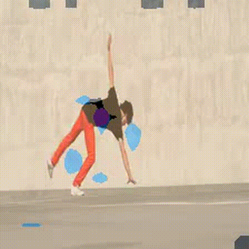

# vjepa_segmentation

Fast human-parsing (bg, hair, face, torso, arms, legs) using **frozen V-JEPA features** and a **light FPN head**.
Train supervised on CIHP (remapped to 6 classes).
Due to computation limit, it is 500(train)/100(val) images only.
Inference works on images and videos; optional EMA smoothing for minimal temporal flicker.


## See Demo (results)
**Image overlay**


**Video (GIF preview)**



> We commit only small media; big weights stay local.

## Quickstart

```bash
    python -m venv .venv && source .venv/bin/activate
    pip install -r requirements.txt
    pip install -e .
```

### Smoke test (no big downloads)
Runs end-to-end with a dummy backbone (verifies install only):

```bash
python -m vjepa_seg.inference \
  --config configs/cihp_linear_fpn.yaml \
  --image samples/person.jpg \
  --out media/smoke_out.png \
  --ckpt "" \
  --dummy_backbone 1
```

### Real inference (needs weights)

Place your local checkpoints (not in git):

ckpts/vjepa2_vitl_256.pt
ckpts/head_linear_fpn_best.pt


### Run on the sample image:
```bash
python -m vjepa_seg.inference \
  --config configs/cihp_linear_fpn.yaml \
  --image samples/person.jpg \
  --out media/demo_image_overlay.jpg \
  --ckpt ckpts/head_linear_fpn_best.pt \
  --vjepa_ckpt ckpts/vjepa2_vitl_256.pt
```

### Run on the sample video:

```bash
python -m vjepa_seg.inference \
  --config configs/cihp_linear_fpn.yaml \
  --video samples/clip.mp4 \
  --out out.mp4 \
  --ema 0.6 \
  --ckpt ckpts/head_linear_fpn_best.pt \
  --vjepa_ckpt ckpts/vjepa2_vitl_256.pt
```
> Note: `backbone_vjepa.py` exposes a clean interface for V-JEPA features. If you don't have V-JEPA weights handy, set `--dummy_backbone 1` to use a random frozen backbone for smoke tests.
